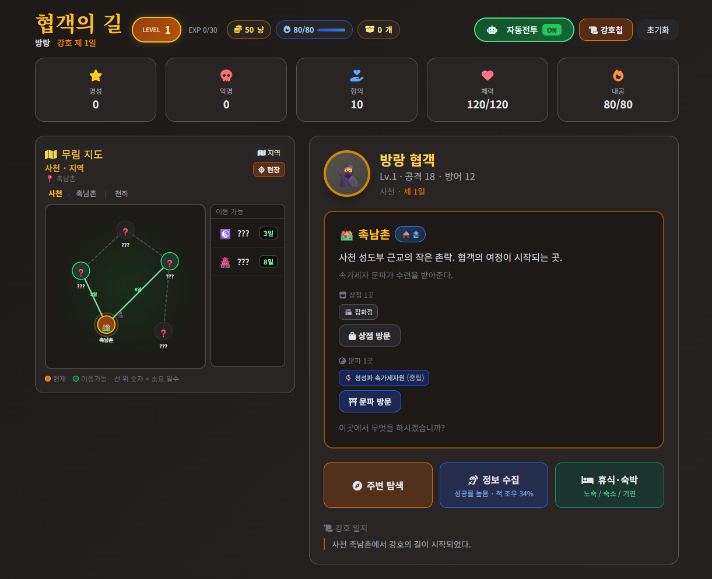

# 협객의 길 — 무림 선택 RPG

사천 촉남촌에서 시작하는 브라우저 무림 RPG입니다. 지도 이동, 전투, 문파, 정보 수집, 휴식·숙박을 즐길 수 있습니다.

> **제작:** 이 게임은 **[Grok AI](https://grok.com)** 와의 대화·협업을 통해 설계·구현되었습니다. (xAI)

## 기동 화면 (예시)



*스크린샷: Grok AI 보조로 제작된 기동 화면*

## 플레이 방법

### 로컬 실행

```bash
git clone https://github.com/mei-son/murim-game.git
cd murim-game
npx serve -l 3850
```

브라우저에서 http://localhost:3850/ 접속

### GitHub Pages

저장소 **Settings → Pages** 에서 `main` 브랜치, `/ (root)` 선택 후  
https://mei-son.github.io/murim-game/ 에서 플레이할 수 있습니다.

## 주요 기능

- **3단계 지도** — 천하도 · 지역 · 현장
- **이동·조우** — 일반/네임드 랜덤 조우, 자동·수동 전투
- **문파** — 대련, 견식, 도장깨기(단계제), 수련, 숙박
- **거점 규모** — 대도·촌·외곽에 따른 상점·문파 차등
- **휴식** — 노숙 / 숙소 / 기연·문파 숙박

## 기술 스택

- HTML + Vanilla JavaScript (ES modules)
- Tailwind CSS (CDN)
- 빌드 없이 정적 호스팅 가능

## 크레딧

- 게임 기획·코드: **Grok AI** (xAI) 보조 생성 + [mei-son](https://github.com/mei-son) 큐레이션·배포

## 라이선스

개인 프로젝트 — 자유롭게 fork·수정 가능합니다.